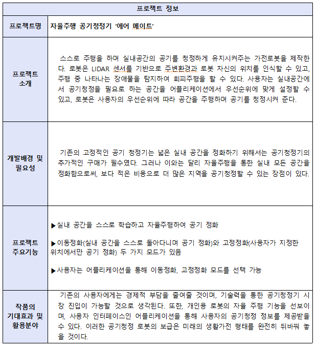
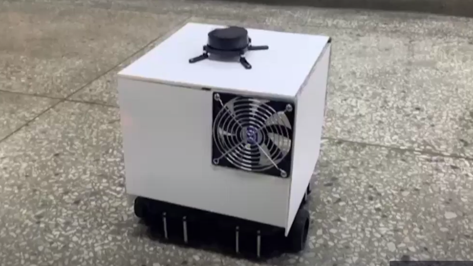
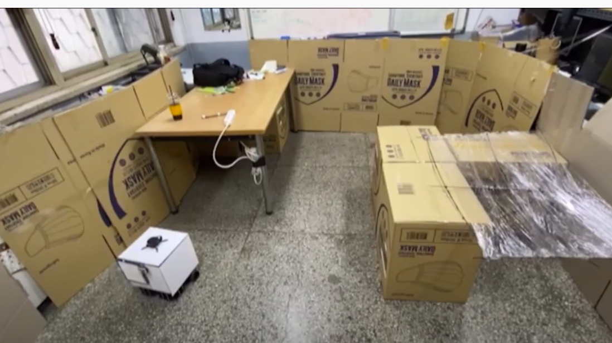
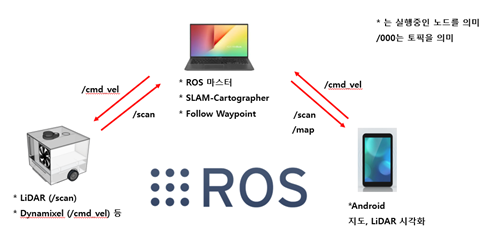
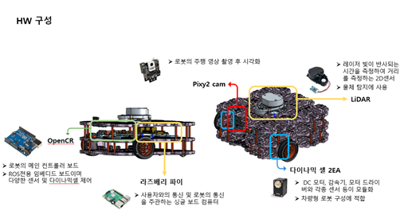
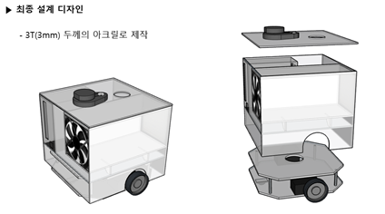

**본 프로젝트는 종합설계프로젝트 과목을 통해 YDMM이라는 팀 이름으로 [장희덕](https://github.com/Heedeok), 고상민, 이하영, 변병문 4인으로 구성되어 진행되었습니다.**

**본 Repository는 YDMM 프로젝트 진행시 사용되었던 것을 Fork 해 왔으며 [장희덕](https://github.com/Heedeok) 학생이 작성한 것을 [변병문](https://github.com/Byung-moon)이 수정 및 내용 추가 하였습니다**

　
 　
  　
   
# airmate(for melodic)

## Purpose
 기존의 고정적인 공기청정기와는 달리 자율주행을 통한 실내 모든 공간을 정화함으로써, 보다 적은 비용으로 더 많은 지역을 공기청정할 수 있는 제품을 개발하고자 함.
 
 


## 제품 모습
> 제품 외형



> 제품 주행 테스트 시나리오 환경




> ROS 시스템을 이용한 HW와 SW의 통신



> HW 구성



> 최종 설계 디자인




## Environment
- ubuntu : 18.04
- ROS : melodic
- python : 2.7
- Android 6.0(API Level 23)

## Used Library for Autonomous Driving
- [cartographer](https://github.com/Byung-moon/cartographer) 
  : Cartographer is a system that provides real-time simultaneous localization and mapping (SLAM) in 2D and 3D across multiple platforms and sensor configurations.

- [follow_waypoints](https://github.com/Byung-moon/follow_waypoints)
  : A package that will buffer move_base goals until instructed to navigate to all waypoints in sequence.

## Install
#### install ros(melodeic)
```
# install ros-melodic from ros.org
sudo apt-get update
```
#### install wstool and rosdep
```
sudo apt-get install -y python-wstool python-rosdep ninja-build stow
```

## PC setup
#### make workspace
```
mkdir -p catkin_ws/src
```

#### install dependent pacakges for Turtlebot3 control on remote PC
```
cd catkin_ws/src
git clone https://github.com/ROBOTIS-GIT/turtlebot3_msgs.git
git clone -b melodic-devel https://github.com/ROBOTIS-GIT/turtlebot3.git
```
#### install cartorgapher
```
cd catkin_ws
wstool init src
wstool merge -t src https://raw.githubusercontent.com/cartographer-project/cartographer_ros/master/cartographer_ros.rosinstall
wstool update -t src

# install cartographer_ros dependencies
rosdep update
rosdep install --from-paths src --ignore-src --rosdistro=${ROS_DISTRO} -y

# install abseill-cpp library for cartographer
src/cartographer/scripts/install_abseil.sh
```
#### install airamte_navigation
```
mv [airmate_navigation_kg] path/to/yout_ws
```
#### build and install
```
catkin_make_isolated --install --use-ninja
```

## Usage
#### start master node
```
roscore
```
#### run cartographer
```
roslaunch turtlebot3_slam turtlebot3_slam.launch slam_methods:=cartographer configuration_basename:=turtlebot3_lds_2d_gazebo.lua
#if you executing cartographer on real environment, change the configuration_basename to :=turtlebot3_lds_2d.lua)
```

#### run airmate_navigation
```
rosrun airmate_navigation airmate_navigation.py

# create waypoints
Use RViz’s "2D Pose Estimate" tool to create waypoints with mouse clicks.
Or use application's '이동정화 모드'

# executing '이동정화 모드'
rostopic pub /path_ready std_msgs/Empty -1

# to clear waypoint queue
rostopic pub /path_reset std_msgs/Empty -1
```

### Reference
- Indrotuction youtube : https://youtu.be/Nz0BxnbTmKo

